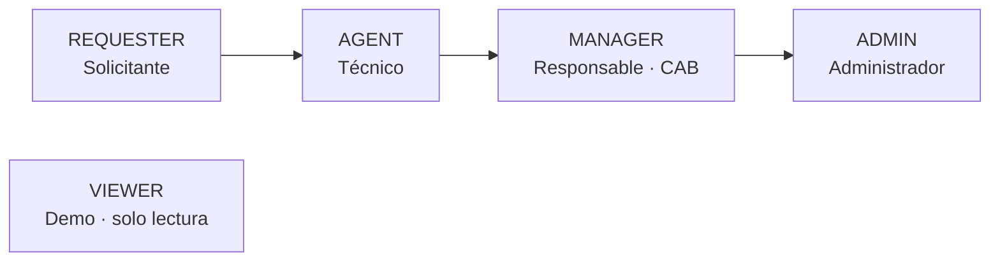
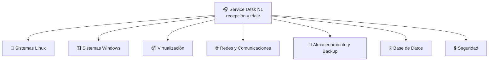
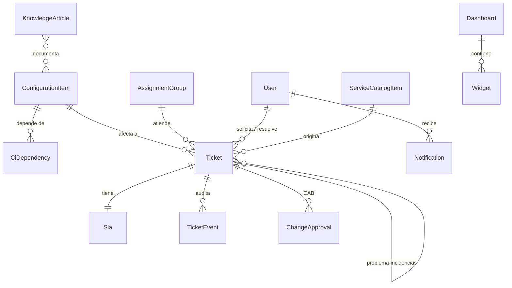

# Nexo · Mesa de servicio ITSM

> ITSM ligero al estilo **ServiceNow / Jira Service Management**: CMDB con análisis
> de impacto, tickets ITIL (incidencias, solicitudes, problemas y cambios), motor de
> SLA con calendario laboral, base de conocimiento con sugerencias semánticas, catálogo
> de servicios y dashboards configurables — **más un servidor MCP que comparte
> exactamente la misma capa de servicios que la web**.

**Demo en producción:** **https://nexus-servicedesk.vercel.app**
Entra con **«Ver demo (solo lectura)»** o con cualquiera de las cuentas de abajo
(contraseña común `Password123!`).

| Cuenta | Rol | Qué puede hacer |
| --- | --- | --- |
| `admin@nexo.dev` | ADMIN | Todo: CMDB de escritura, aprobar cambios (CAB), reasignar. |
| `manager@nexo.dev` | MANAGER | Triaje, aprobar cambios, reasignar. |
| `agente@nexo.dev` | AGENT | Triaje, resolver, comentar, escribir KB. |
| `cliente@nexo.dev` | REQUESTER | Abrir incidencias/solicitudes, autoservicio (KB y catálogo). |
| `demo@nexo.dev` | VIEWER | Lo ve **todo** en modo lectura; no modifica nada. |

---

## La tesis del proyecto

La lógica de negocio vive en **una única capa de servicios** (validación con Zod +
RBAC por rol + reglas ITIL). Tanto la **interfaz web** (Server Actions y Route
Handlers de Next) como el **servidor MCP** (para agentes de IA) llaman a **las mismas
funciones**: nadie toca la base de datos directamente y toda acción queda registrada
como `TicketEvent` auditable —indistintamente de si la originó una persona o un agente.

```mermaid
flowchart TD
    subgraph Clientes
        UI["🌐 Web (navegador)<br/>React 19 · Next App Router"]
        AG["🤖 Agente IA<br/>cliente MCP"]
    end

    subgraph Next["Next.js 16 · Vercel (región fra1)"]
        SA["Server Actions<br/>+ Route Handlers"]
        MCP["Route Handler MCP<br/>/api/&#91;transport&#93;<br/>5 tools"]
        AUTH["better-auth<br/>/api/auth/*"]
        SVC["⭐ Capa de servicios<br/>Zod + RBAC + reglas ITIL<br/>(can / assertCan)"]
    end

    DB[("PostgreSQL · Neon<br/>eu-central-1 (Frankfurt)")]
    HF["Hugging Face<br/>Inference API<br/>(embeddings KB)"]

    UI --> SA
    UI --> AUTH
    AG --> MCP
    SA --> SVC
    MCP --> SVC
    SVC --> DB
    SVC -.->|sugerencias KB| HF
    AUTH --> DB
```



Cada `Ctx` (contexto de actuación) lleva `actorKind` (`USER` o `AGENT`), `actorId` y
`role`. **El permiso se decide siempre en el servicio**, nunca en la UI ni en el handler.

---

## Qué garantiza la web

Cubre las prácticas ITIL nucleares de una mesa de servicio:

- **Gestión de incidencias y solicitudes** — alta con prioridad **derivada de impacto ×
  urgencia** (matriz P1–P4), triaje (asignación + repriorización), notas de trabajo,
  cambios de estado con transiciones válidas y resolución con causa.
- **CMDB (Configuration Management Database)** — 200+ elementos de configuración
  (servidores, BD, red, almacenamiento, apps…) con tipo, entorno, datacenter, criticidad
  y **grafo de dependencias**. **Análisis de impacto aguas abajo**: «si este CI cae, ¿qué
  más se ve afectado?».
- **Gestión de problemas** — vincular incidencias a un problema, marcar *known error*.
- **Gestión de cambios (RFC) + CAB** — proponer cambios con tipo y riesgo; el **Change
  Advisory Board** (manager/admin) aprueba o rechaza con *gating* de estado.
- **Motor de SLA** — objetivos de respuesta/resolución calculados sobre **calendario
  laboral** (horario de oficina, no 24×7), con estado *en plazo / en riesgo / incumplido*.
- **Reportes de SLA** — tendencia de cumplimiento por periodo y **exportación CSV** y
  **versión imprimible (PDF)**.
- **Base de conocimiento** — artículos en Markdown con **sugerencias semánticas**
  (embeddings + similitud coseno) en la ficha de cada ticket.
- **Catálogo de servicios** — peticiones de autoservicio que abren tickets tipados.
- **Dashboards configurables** — cuadrícula *drag & resize* (GridStack) con widgets
  (indicadores, barras, donut, líneas, listas) que persisten su layout.
- **Búsqueda global ⌘K** — paleta de comandos (tickets, CIs, artículos y acciones).
- **Notificaciones in-app**, **modo claro/oscuro** y **RBAC** de extremo a extremo.

---

## Red organizativa (roles y grupos)

### Jerarquía de roles (RBAC)



### Grupos de asignación y escalado

El **Service Desk N1** recibe y tría; lo que excede el primer nivel **escala** al
grupo especialista que corresponde según el CI afectado.



| Permiso | REQUESTER | VIEWER | AGENT | MANAGER | ADMIN |
| --- | :---: | :---: | :---: | :---: | :---: |
| `ticket:create` | ✅ | — | ✅ | ✅ | ✅ |
| `ticket:read:all` | — | ✅ | ✅ | ✅ | ✅ |
| `ticket:triage` / `update` / `comment` | — | — | ✅ | ✅ | ✅ |
| `ticket:reassign` | — | — | — | ✅ | ✅ |
| `problem:create` / `change:create` | — | — | ✅ | ✅ | ✅ |
| `change:approve` (CAB) | — | — | — | ✅ | ✅ |
| `cmdb:read` | — | ✅ | ✅ | ✅ | ✅ |
| `cmdb:write` | — | — | — | — | ✅ |
| `kb:read` / `catalog:read` | ✅ | ✅ | ✅ | ✅ | ✅ |
| `kb:write` | — | — | ✅ | ✅ | ✅ |
| `dashboard:write` | — | — | ✅ | ✅ | ✅ |

> El **solicitante** solo ve sus propios tickets; del rol **AGENT** en adelante se ve la
> cola completa. El **VIEWER** (demo) lo ve todo pero no tiene ningún permiso de escritura.

---

## Modelo de datos (resumen)



Modelos principales: `ConfigurationItem`, `CiDependency`, `Ticket`, `Sla`,
`TicketEvent`, `ChangeApproval`, `AssignmentGroup`, `KnowledgeArticle`,
`ServiceCatalogItem`, `Dashboard`, `Widget`, `Notification` (+ `User`, `Session`,
`Account`, `Verification` de better-auth).

---

## Stack

| Capa | Tecnología |
| --- | --- |
| Framework | **Next.js 16** (App Router, Server Components, Server Actions) · **React 19** |
| Lenguaje | **TypeScript** (estricto) |
| UI | **shadcn/ui** (variante **base-ui**) · **Tailwind CSS v4** · lucide-react · sonner |
| Datos | **Prisma 7** (`@prisma/adapter-pg`) · **PostgreSQL** (Neon, región EU) |
| Auth | **better-auth** (email/contraseña, rol como campo de usuario) |
| Validación | **Zod** |
| Gráficas / grid | **Recharts** · **GridStack** · **@xyflow/react** + Dagre (grafo CMDB) |
| KB semántica | **Hugging Face Inference API** (`paraphrase-multilingual-MiniLM-L12-v2`, 384 dims) |
| Agentes | **MCP** (`mcp-handler` + `@modelcontextprotocol/sdk`) |
| Calidad | **Vitest** (unitarios) · **Playwright** (e2e) · **ESLint** · **GitHub Actions** |
| Hosting | **Vercel** (funciones en `fra1`, junto a la BD) |

---

## Puesta en marcha local

Requisitos: **Node ≥ 22.13**, **pnpm 11** y **Docker** (para el Postgres local).

```bash
# 1. Dependencias
pnpm install

# 2. Variables de entorno (ver .env.example)
cp .env.example .env

# 3. Postgres local (Docker, puerto 5433)
docker compose up -d

# 4. Esquema + datos de demo
pnpm exec prisma migrate deploy
pnpm db:seed

# 5. Arrancar (http://localhost:3300)
pnpm dev
```

> Las **sugerencias de la KB** requieren `HF_TOKEN` (token gratuito de Hugging Face). Sin
> él, el resto de la app funciona igual; solo se omiten los embeddings al sembrar.

### Scripts

| Script | Acción |
| --- | --- |
| `pnpm dev` | Servidor de desarrollo (puerto 3300) |
| `pnpm build` / `pnpm start` | Build y arranque de producción |
| `pnpm lint` | ESLint |
| `pnpm test` / `pnpm test:watch` | Unitarios (Vitest) |
| `pnpm test:e2e` | End-to-end (Playwright) |
| `pnpm db:migrate` / `db:seed` / `db:studio` | Prisma: migrar / sembrar / inspeccionar |

---

## Tests y CI

- **221 pruebas unitarias** (Vitest) sobre la capa de servicios contra una BD aislada
  (`nexo_test`), y **6 e2e** (Playwright) de los flujos críticos (login, alta de ticket,
  dashboards, modo solo-lectura del demo).
- **GitHub Actions** (`.github/workflows/ci.yml`) ejecuta en cada push/PR dos jobs:
  `Typecheck · Lint · Vitest` y `Playwright e2e`, ambos con Postgres efímero.

```bash
pnpm exec tsc --noEmit && pnpm lint && pnpm test && pnpm test:e2e
```

---

## Servidor MCP

Expuesto en `/api/[transport]`. Cinco herramientas que reutilizan la capa de servicios
(RBAC incluido) y dejan rastro auditable como agente:

`crear_incidencia` · `analizar_impacto` (impacto aguas abajo en la CMDB) ·
`triar_ticket` · `resumir_tickets` · `sugerir_cambio`.

---

## Despliegue

- **Vercel** conectado al repo (auto-deploy en `main`). `vercel.json` fija las funciones
  en **`fra1`** para colocarlas junto a la base de datos.
- **Neon Postgres** en **eu-central-1 (Frankfurt)** — co-localizar cómputo y datos en la
  UE evita la latencia recurrente de cruzar el Atlántico (principal mejora de TTFB).
- Variables en producción: `DATABASE_URL`, `BETTER_AUTH_SECRET`, `BETTER_AUTH_URL`,
  `HF_TOKEN` (ver `.env.example`).

> **CORS:** la aplicación es *same-origin* (la UI y `/api/auth/*` comparten origen;
> better-auth confía en `BETTER_AUTH_URL` en producción). No hay API de navegador
> entre orígenes, por lo que no requiere configuración CORS adicional.

---

## Estructura

```
src/
├── app/
│   ├── (app)/         # área autenticada: dashboards, tickets, cmdb, kb, catálogo, reportes
│   ├── (print)/       # versión imprimible de reportes
│   ├── actions/       # Server Actions (delegan en la capa de servicios)
│   └── api/           # better-auth y servidor MCP
├── components/        # UI (shadcn/base-ui) + componentes de dominio
├── lib/
│   ├── services/      # ⭐ capa de servicios: RBAC, reglas ITIL, queries
│   ├── mcp/           # contexto del agente MCP
│   ├── auth.ts        # better-auth
│   └── embeddings.ts  # Hugging Face Inference API
prisma/                # schema, migraciones y seed
e2e/                   # pruebas Playwright
tests/                 # pruebas Vitest
```

---

Proyecto de portfolio de **Daniel Rodea** — diseño y desarrollo propios.
